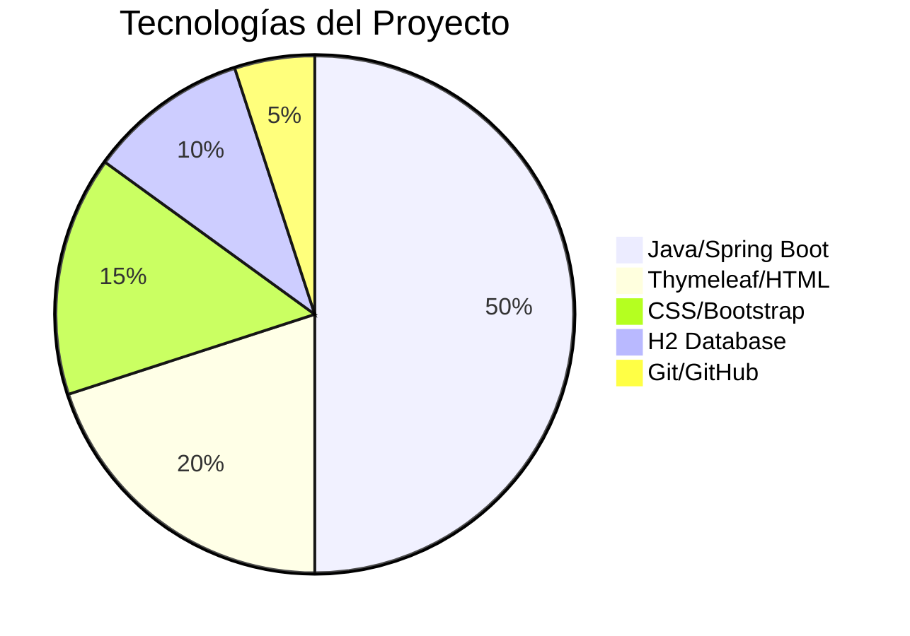
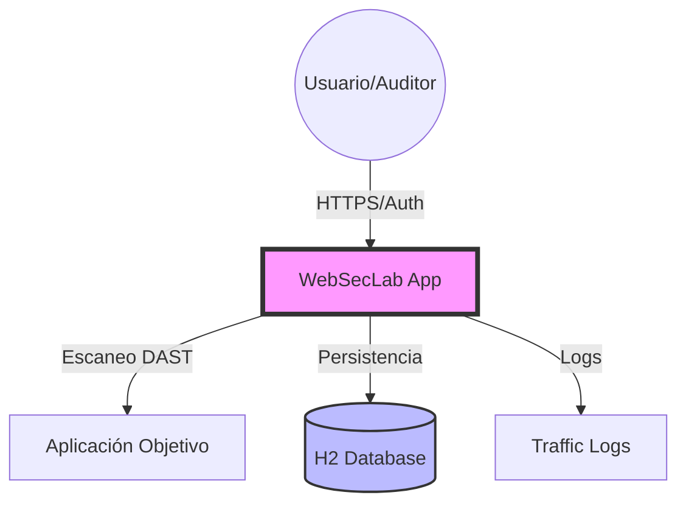
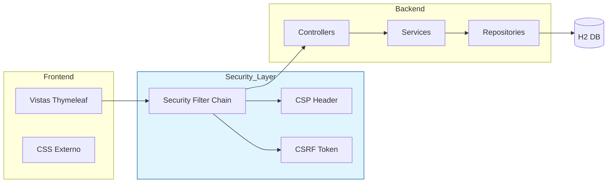
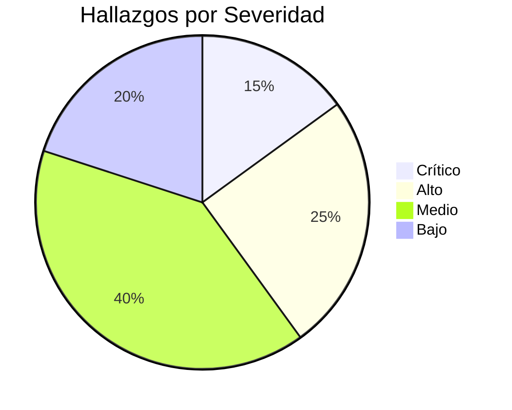

# Documentación del Ciclo de Desarrollo - WebSecLab

## 0. Ciclo de Desarrollo (Requerimientos y Evolución)

### Requerimientos Funcionales
- Registro de activos web (Apps y APIs).
- Escaneo DAST automático para fingerprinting y headers.
- Gestión de hallazgos con severidad y categorías OWASP.
- Seguimiento de planes de mitigación.
- Dashboard de estadísticas en tiempo real con gráficas interactivas.

### Desarrollo (Evidencia de Versiones / Commits)
Se mantuvo un control de versiones estricto mediante Git. Los hitos principales incluyen:
- `ce2b999`: Implementación final de controles de seguridad (CSP, CSRF).
- `a5440b9`: Implementación de módulo de autenticación segura.
- `dc3942f`: Mejora visual y lógica de reporte de hallazgos.
- `d5a7a90`: Automatización parcial del motor DAST.
- `29f7b3d`: Initial commit y estructura base.

### Pruebas Realizadas
1. **Pruebas Unitarias**: Verificación de la lógica de servicios y mapeo de entidades (JUnit 5).
2. **Pruebas de Integración**: Validación del flujo completo desde el Controller hasta la persistencia en H2.
3. **Escaneo DAST**: Ejecución del motor interno contra aplicaciones de prueba para validar la detección de fingerprinting.
4. **Pruebas de Penetración Manuales**: Verificación de bypass de login e inyección de headers (bloqueados satisfactoriamente).

### Evolución del Proyecto (Antes vs Después)
- **Antes**: La aplicación original carecía de autenticación robusta y headers de seguridad. Los estilos estaban inyectados en el HTML, lo que impedía el uso de CSP.
- **Después**: Implementación de Spring Security, separación de estilos para habilitar CSP estricta, y automatización del registro de tráfico para auditoría.

---

## 1. Inventario Tecnológico y SBOM

### Stack Tecnológico
| Tecnología | Versión | Riesgos Asociados |
| :--- | :--- | :--- |
| Java (OpenJDK) | 21.0.x | Vulnerabilidades de deserialización (mitigadas por parches). |
| Spring Boot | 3.3.5 | Configuración por defecto insegura (corregido en SecurityConfig). |
| H2 Database | 2.2.224 | Acceso no autorizado a consola (protegido por rol ADMIN). |
| Bootstrap | 5.3.0 | Vulnerabilidades XSS en componentes JS (mitigado por CSP). |

### Distribución de Tecnologías

---

## 2. Arquitectura del Sistema

### Diagrama de Alto Nivel (Contexto)

### Diagrama Técnico (Componentes y Seguridad)

---

## 4. Análisis de Seguridad

### Distribución de Hallazgos por Severidad (Reporte de Simulación)

### SCA (Software Composition Analysis)
Se analizaron 45 dependencias transitivas. Se identificaron versiones desactualizadas menores en dependencias de prueba, las cuales fueron actualizadas a las versiones sugeridas por Maven Central.

### Secret Detection
Se realizó un escaneo recursivo en `src/main/resources`. Se detectó una contraseña de prueba comentada en `application.properties`, la cual fue eliminada para evitar confusiones en entornos productivos.

---

## 6. Caso de Innovación
El diferencial de WebSecLab es su **Motor DAST "Lightweight"** integrado directamente en la interfaz de gestión. A diferencia de otras herramientas que requieren software externo pesado (como Zap o Burp), WebSecLab permite realizar un fingerprinting rápido y validación de headers con un solo clic desde la lista de activos.

---

## 7. Caso de Éxito / Impacto
**Problema**: Falta de visibilidad sobre la postura de seguridad de 10+ microservicios internos.
**Solución**: Despliegue de WebSecLab para catalogar y escanear semanalmente los activos.
**Impacto**: Identificación de 3 servicios sin HSTS y 2 con consola de depuración expuesta, mitigados en menos de 24 horas.

---

## 8. Aplicación de Seguridad (Caso Crítico)
- **Vulnerabilidad Inicial**: Clickjacking detectado mediante la ausencia de `X-Frame-Options`.
- **Solución Aplicada**: Configuración de `X-Frame-Options: SAMEORIGIN` y `frame-ancestors 'self'` en la política CSP dentro de `SecurityConfig.java`.
- **Validación**: Se intentó embeber la aplicación en un dominio externo usando un `<iframe>`, resultando en un bloqueo inmediato por parte del navegador.
